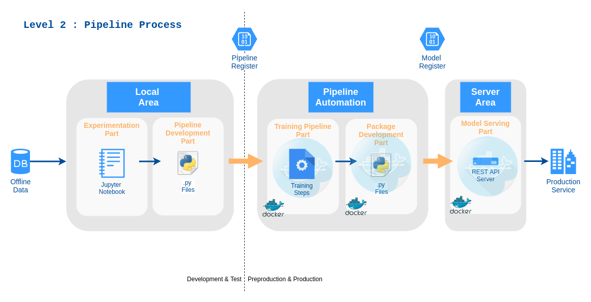

# ML System Project

It is a ML system project.This repo aims to show how it be MLOps & CI/CD practices with a ML project. There are three stages. Each stages are more complex and complete than previous stage.

- First stage is simple-basic studies. It is mostly reference and inspiration from [this article](https://cloud.google.com/solutions/machine-learning/mlops-continuous-delivery-and-automation-pipelines-in-machine-learning).

- Second stage is more complex than first stage. It contains extra parts like data pipeline and testing.

- Third stage is final stage. It contains modern ML-system project that is gained some modern skill and abilities like MLOps, CI&CD and data pipelines.

## A. Firt Stage : `MLOps level 1 : Manual Process`

This part provides a basic primative ML-project. It is similar reference article. It is a regression model. It uses famous house-price data. The model schema looks like below image.

**Check  [`level-1-regression-model`](https://github.com/omrylcn/ml_system/tree/level-1-regression-model) branch**

## B. Second Stage : `MLOps level 2 : Pipeline & Test` 

This is next level ML project. It includes pipeline stucture with dockers and different level test. Also there is a independent training part that is updated by  local-area works. It uses [rossman-store sales](https://www.kaggle.com/c/rossmann-store-sales) data. ML system schema looks like below image.   

**Check  [`level-2-pipeline&test`](https://github.com/omrylcn/ml_system/tree/level-2-pipeline%26test) branch** 

## C. Third Stage : `MLOps level 3: CI&CD` (To do)

## References

- <https://cloud.google.com/solutions/machine-learning/mlops-continuous-delivery-and-automation-pipelines-in-machine-learning>

- <https://www.trainindata.com/feature-engine>

- <https://github.com/solegalli/deploying-machine-learning-models>

