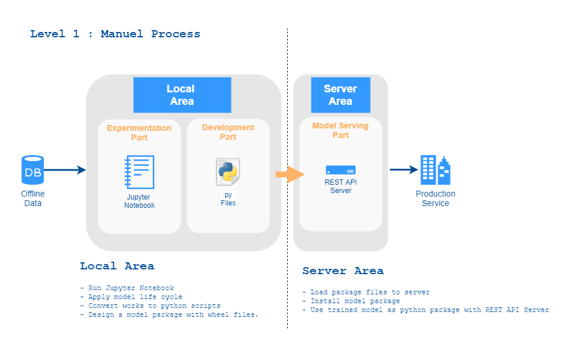

# A. Firt Stage : `MLOps level 1: Manual process`

This part provides a basic primative ML-project. It is similar reference article. It is a regression model. It uses famous house-price data. The model schema looks like below image.

=======

## Summary

- There are three main parts like `data processing,training and prediction`.
- `pipeline` : scikit-learn - model is saved as pipeline
- `Docker` : model prediction service is a docker image  
- `.yml`:format of model config files

## Notes

- There is a python package(wheel file) that is called reg_model in `package_files` folder. It can be installed via `pip`.
- To run `docker files`  reads `notes.md` in docker folder.

## How Run
- Simply, use docker, check dockerfiles, read [notes.md](docker/notes.md)
- `To run model` : enter `development`folder, install packages in `requirements.txt file. Then import `reg_model` module and :) 
- `To run model server` : enter `model_serving` folder, install packages in `requirements.txt` file, install `model-package` in package folder, `run app.py` and :) 

**Important Note:**
This app is only designed a specific model that is called reg_model, it cannot be used directly with any model

## To Do List

- [x] Model Training
- [x] Model Saving and Making Package
- [x] Model Serving
- [ ] Add .yml file to Model Serving

